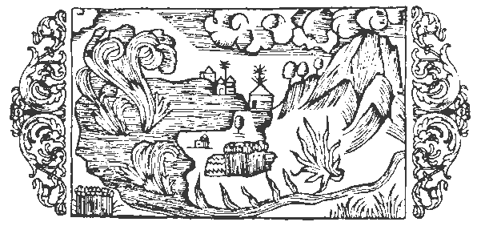

# Om brinnande vatten

Här och där finnas i närheten af vattendrag svafvelådror, hvilka stundom fatta eld och utbreda sig vidt och bredt med flammor, som hota att ödelägga allt i omgifningen. Detta skådespel hafva invånarna på Island och i Skottland, hvilka båda land utmärkas af stark köld, tillfälle att se under ständigt tilltagande hetta. Äfven i södra Götaland, ej långt från staden Vexiö, ligger på en slätt en sjö med dybotten, hvilken på grund af sin hetta gör, att alla kokbara ämnen, som nedsänkas i densamma och sedan medelst ett snöre upphämtas, befinnas ögonblickligen eller på en kort stund kokta eller brända. Samma egenskap har visat sig hos en liknande insjö nära metropolen Nidaros i konungariket Norge, och detta i synnerhet af det skäl, att den midt i vinterkölden aldrig tillfryser, hvarom förut något ordats och, om så behöves, kommer att närmare talas längre fram i kapitlet om källor. Saken bestrykes ytterligare af det faktum, att i den nordiska bergens grufvor  värmen kommer af svafvel, liksom torkan kommer af solen. Det är alltid en förnöjelse att utröna en dold företeelse, såsom då vattendrag afgifva glödande ångor och hetta och värme sluta trofast förbund med vågorna och alstras genom nedstörtande vatten, af hvilka de eljest pläga utsläckas. Därför pläga också filosoferna säga, att elementerna ömsesidigt ingå förbindelser och förena sig i ett underligt kamratskap (dessa elementer som anses sinsemellan föra en oblidkelig strid), såsom t.ex. ett fuktigt ämne kan frambringa glödande dunster. Detta ämne utgjuter sig genom kanaler, hvarvid det själft blir ljummare, ehuru det afger värme åt luften, och kan efter behag bekvämt lämpas till att användas för badändamål, en både behaglig och nöjsam användning, därtill att likställa med en ljuflig medicin, ty därigenom vinnes en behandling utan plåga, ett läkemedel utan fasa, som ger hälsa utan allt obehag. Dessa svafvelbad, som både hämta ursprung och sin näring ur jordens eldådror, fördelas i värmealstrande kanaler och utsträckas så långt som möjligt, till dess att de heta ångorna småningom afdunsta och öfverfå till kylig beskaffenhet. Emellertid står Skriftens ord fast, då det i Vishetens bok (sista kapitlet) läses: ›Elden var öfvermäktig i vattnet utöfver sin natur, och vattnet förgat sin kraft, som är att utsläcka. Tvärtom, lågorna skadade ej de ömtåliga djurens kött, när de vandrade däröfver, och tillintetgjorde ej denna goda föda, hvilken eljest lätt upplösen liksom is.› Därjämte förmäler Augustinus, att offerelden, som under sjuttio år af den babyloniska fångenskapen lefvat under vattnet, utsläcktes först i och med detsamma som Antiochus sålde prästadömet till Jason. Än vidare styrker Hieronymus, att en sådan natur innebor i elden, att om den blott förses med behöflig näring, stiger den ej blott högt upp i luften, utan förtär dessutom allt, ej mindre vatten än klippor. Och Cassiodorus erinrar (Epist., bok 3) om berget Vulcanus, hvilket väckte förvåning, därför att, ehuru det flammade af en otalig mängd lågor, det dock hade sin grund förlagd i hafvets böljor och dess glöd var vid oafbrutet lif, ehuru den syntes böra utsläckas af så väldigt hafssvall. Vill man än vidare studera Volaterranus (bok 25), skall man finna, att det gifves ett slags beck och en art orm som kunna släcka eld, ja att den t.o.m. i Egypten skall finnas en stenart med den egenskapen, att när den öfvergjutes med vatten, ger den ifrån sig eld, liksom bränd kalk, hvilken ej tändes, om den ock öfvergjutes med beck, olja, harts, fett eller annan vätska: endast vatten är verksamt, såsom också Augustinus (De cevit. Dei, bok 21) betyglar; hvilken lönnlig kraft som är verksam i dessa naturens under, det göres där uppenbart för intresserade forskare. Ja själfve Plinius anför (bok 14, kapitel 20), att torkad vindrägg fattar eld och brinner af sig själf utan annan näring. Andra underbara egenskaper hos elden och vattnet behandlar samme författare omständligt i nägra ad det sista kapitlen i bok 2.