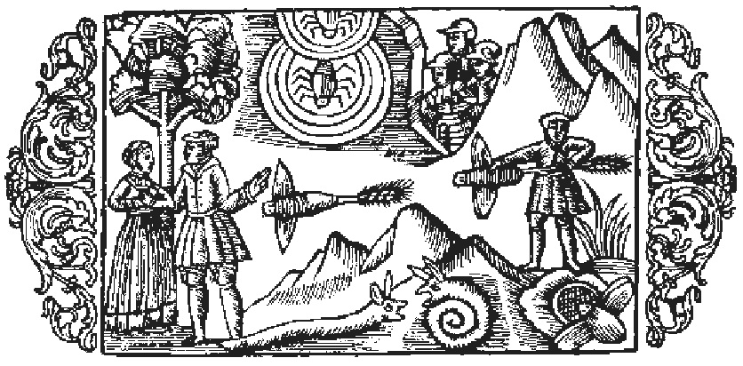

# Om spindlar

Först möter oss då spindlarnas mångskiftande släkte, hvars olika arter skilja sig från hvarandra till färg, storlek och medfödd instinkt, men alla äro lika underbara. Det gifves ett slags spindel, stor som en nöt, hvilken under ljusa nätter och om dagen invid större fönster ständigt sysslar med att fånga flugor som komma fram vid måltiderna, lockade af den myckna maten, och äro de spisande till förtret. Vidare finns det ett slags spindel, som visserligen är mindre till kroppen, men farligare genom sitt gift. Den går på jakt i dörröppningarna och samlar i sitt nät en sådan mängd flugor, att det blott behöfves en liten vindfläkt för att sönderslita detta. Men den är ej sen att laga det igen för att fånga nytt byte. För att skydda sig mot den kalla vinden gör detta slags spindel också en luddig väf, hvilken ser ut som den tunnaste hud, och denna utspänner den icke blott mellan de stora, höga boningshusen, utan äfven mellan de yfvigaste träden i skogen för att däri fånga späda ödlor, gräshoppslarver och getingar; honan tillverkar väfven, hannen åter jagar de små djuren. Allt efter som en slik väf sitter högt eller lågt, är det för landtmannen ett tecken, om han skall så uppe på höjden eller nere i dalen; liknande är förhållandet med bäfrarnas hyddor, såsom i det föregående blifvit anmärkt. Utom den olikhet, som förefinnes mellan dessa två slag, gifves det ytterligare, som sagda, skiljaktigheter spindlarna emellan, ity att somliga äro stora och nästan runda, andra ha formen af en långsträckt cylinder, andra äro små, andra mycket små, åter andra spinkiga och smala. Några äro askgrå till färgen, några gröna, några ha kroppens alla delar olika färgade och flera krithvita ränder på ryggen. En del ha långa fötter och springa omkring i gräset samt suga vätskan ur de frukter och döda djur, de händelsevis påträffa. En del sitta på lur i hål i marken, kasta sig med ett språng öfver de små djur, som krypa förbi, och suga ut dem. En del slutligen, de spindlar som på grekiska kallas trixaler, löpa öfver vattenytan på höga ben och fånga småfisk och jaga mygg. Spindeln parar sig i slutet af våren, och när honan åstundar att para sig, drager hon hannen till sig med sin tråd. Om hösten lägger hon ägg, och vid vårens början utkläckes ynglet. När spindeln tillverkar sin väf, gifver den akt på fem ting. Ämnet hämtar den från öfverflödet af det våta, som den upptagit ur den dagliga födan, men om för mycket vätska går bort, mister den sin kraft. Tiden tager den i akt, ty redan tidigt om morgonen spinner den om sitt nät, som under dagens lopp bli 
fvit sönderrifvet, eller lagar det gamla och är aldrig så ifrig i detta sitt arbete som just i gryningen. Platsen för nätets uppsättande väljer den med klok beräkning, ity att den med förkärlek spänner det högt uppe i vinklar och vrår, vid väggar eller träd. Formen lämpar den efter förhållandena, i det den vid trådarnas spinnande till ett nät gör detta antingen rundt, trekantigt eller aflångt. Tillvägagångssättet vid arbetet slutligen är likaledes omsorgsfullt, ty den stora spindeln drager med den ena bakfoten ut ur sin buk tråden, hvaraf den vill väfva sitt nät. En annan sorts spindel däremot hasplar ut ur sin mun tråden, hvaraf den sedan med ena framfoten tillverkar väfven och spänner ut den vidt och bredt. Ty likasom Herren, såsom Ambrosius säger i Hexameron (bok 5, kapitel 9), har förlänat kvinnan insikt i väfnadskonsten, så har Han icke heller låtit spindeln, som så fint och konstförfaret anbringar sitt slaka nät i dörröppningarna, vara utan en liknande insikt. Denna spindel ›lägger ger upp väfvar›, enligt hvad Plinius säger (bok 11, kapitel 24), ›och till det stora verket lämnar dess egen buk tillräckligt ämne, vare sig nu, såsom Democritus håller före, bukens beskaffenhet vissa tider blir så fördärfvad, eller där inne finnes en viss förmåga att alstra spånadsämne. Med hvilken noggrann het betjänar den sig ej då af fötterna, med hvilka runda och jämna trådar utför den ej sin väfnad och tjänar därvid sig själf som vikt! ›Om spindelns nät har äfven Paulus Diaconus en förträfflig skildring (bok 6, kapitel 4). 

- Spindlarnas släkte mångskiftande 
- Spindeln gör en luddig väf. 
- Spindelhonan tillverkar våfven.
- Hannen jagar. 
- Mångahanda olikheter spindlarna emellan.
- Vid tillverkningen af väfven gifver spindeln akt på fem ting.
- Spindeln drager ut tråden ur munnen.
- Åt kvinnan vardt insikt i väfnadskonsten gifven.
- Spindeln har förmåga att i sitt inre alstra spånadsämne.  