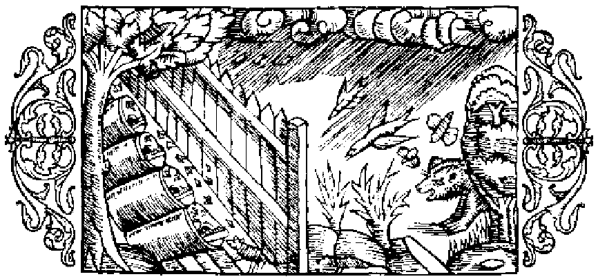

# Om förhållanden, som inverka menligt på bien

Det är ett allbekant sak, att i de nordiska länderna, när den djupa snön väl hunnit smälta, på fält och ängar mångahanda blommande örter i underbar mångfald spira upp och de olika slags träden slå ut i ljufvaste blom. Ofta händer det då, att bien efter den långa fastan under vintern med sådan glupskhet fråssa af dessa blommor, att de bli sjuka, ja till och med plöts ligt dö däraf, såsom äfven Palladius (i 4. boken) betygar, i det han säger: ›Bien taga ofta skada af sin lycka, ty om blomningen ett år är alltför riklig, så ha de ingen tanke på sin afkomma, uteslutande upptagna som de äro af sin äflan att alstra honung. När de sålunda försumma att sörja för tillkomsten af ett nytt släkte, så går det gamla under af öfveransträngning, och hela samhället dör ut.›Fördenskull föreslår nämnde Palladius ett medel häremot, nämligen att under tre dagars tid åt gången hålla öppningen stängd och icke låta bien slippa ut att skaffa honung; hvilket enligt hans förmenande mycket bidrager till afvelns förökande. Aristoteles lär i sitt verk om djuren (bok 9, kapitel 40), att man om vintern bör iakttaga en särskild hushållning för biens räkning, så att man i förhållande till deras mängd sörjer för deras uppehälle. De bli nämligen latare, om man vid vaxkakornas uttagande kvarlämnar mera honung, än de behöfva; därför bör man lämna blott så mycket, som motsvarar biens antal. De bli också oroligare, om man skattar så mycket, att ej återstoden räcker till föda åt dem; likaså bli de trögare, om kupan är alltför rymlig, i det att de, liksom gripna af misströstan, mera ovilligt bedrifva sitt arbete. Plinius säger (bok 21, kapitel 16), att man, hvilket ju också är rimligt, bör för vintern lämna kvar åt bien två tredjedelar af honungsskörden; vidare att det är mödan värdt att vid honungens uttagande väga  kuporna, för att ej bien af brist på föda må gripas af misströstan, rymma sin kos eller dö, eller tvärtom i följd af den rikliga tillgången på honung bli slappa och lata. Tjufvar, kopplare och kvinnor, som ha sin månadsrening, ha ett högeligen menligt inflytande på bien, om de nalkas deras kupor. Palladius säger (i 4. boken) förhållandet vara detsamma med dem, som pläga älskog, och med sådana, som förtära skarp och illaluktande föda äfvensom salt mat af hvarjehanda slag. Af samma mening är Plinius i ofvan anförda boks 18. kapitel, där det heter: ›Bien hata vidrigt luktande ämnen och fly lång väg för dem, men äfven konstgjorda vällukter afsky de. Därför anfalla de sådana människor, som dofta af välluktande oljor, men själfva äro de utsatta för angrepp af många olika slags djur.›

- Bien taga skada af sin alltför stora gulpskhet.
- Man knappar in på biens föda, att de ej må förgås.
- Man bör lämna kvar åt bien tillräcklig föda för vintern.
- Bien kunna ej tåla tjufvar, kopplare och kvinnor, som ha sin månadsrening.
- Bien utsatta för mångahanda angrepp.