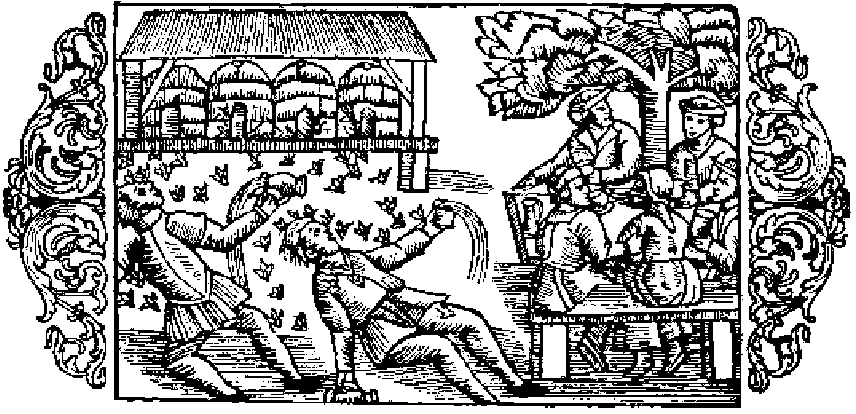

# Om bin, som anfalla berusade personer

När bien bli retade och angipna af andra djur, veta de att kraftigt värja sig mot dem, tack vare sin gadd, det enda vapen de af naturen fått; men aldrig drifvas de till en så förbittrad strid mot en ofredande fiende, som när det gäller att rikta gadden mot en berusad människa med stinkande andedräkt — deras största fasa —, då hon nalkas deras boningar. Det händer ju ofta, att människor, som tagit sig för mycket till bästa, bli liksom tokiga eller alldeles mista förståndet och i följd däraf icke blott bli oförmögna att undvika uppenbara faror, utan rent af själfmant ila dem till mötes och så ljuta döden, somliga genom att störta ned i bråddjup, andra genom drunkning, andra åter genom kväfning. Långt sällare än andra får man då anse den vara, som genom att oförsiktigt nalkas bien med deras stingande gadd åter bringas till sans och besinning, så att han, lyckligen frälst från de större faror, hvarom jag nyss talat, får lära sig att för framtiden allvarligt vinnlägga sig om nykterhet. Bistygnen lämna dock märken efter sig i den berusades ansikte, hvilket ser ut som en köttklump, där man omöjligen kan urskilja några tydliga drag. Det onda häfves emellertid af klokare och om nykterhet mera angelägna personer genom att på svullnaden gjuta saft af frisk kattost eller stryka färskt smör. Enligt Aristoteles (bok 9, kapitel 40) dö bien, när de stinga, enär de icke kunna sticka ut sin gadd, utan att inälfvorna samtidigt komma ut. Den bistungne lider ofta stort men, om han ej kniper om det ställe, där biets gadd jämte dess buk fastnat, och sedan drager ut den därur. Ty med stygnen af sin gadd kunna bien döda äfven stora djur, såsom hästar och deras föl. Också emot dem, som taga ut honungen, kämpa de. Enligt samme författare, å nyss anförda ställe, strida likaledes de korta bien mot de långa och döda dem; likaså taga de lifvet af hvarje främmande insekt, som genom försummelse af väktarna råkat slippa in i deras kupor. ›Då födan tryter i en kupa›, säger Plinius (bok 11, kapitel 7), ›angripa bien grannkuporna i syfte att göra byte. Dessas invånare sätta sig då till motvärn, och om biskötaren är tillstädes, blir han icke anfallen af det parti, som märker, att han gynnar de till detta hörande bien. Äfven af andra anledningar strida de ofta sinsemellan, och tvenne fältherrar ordna de mot hvarandra stående härarna. Oftast uppstår tvisten vid blommornas insamlande, hvarvid hvardera parten kallar de sina till hjälp. Denna strid kan man alldeles göra slut på genom att kasta stoft öfver bien eller utsätta dem för rök; men man försonar dem med mjölk eller honungsvatten.›