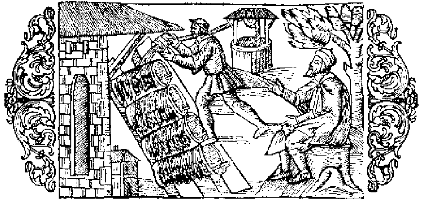

# Hur man skyddar bien under snö och is

Om än vintern i Nordanländerna är synnerligen sträng, sakna dock ej heller deras inbyggare bin och honung, framför allt ej de, som äro bosatta i de södra och östra landskapen. Jordanes har emellertid rätt i sitt påstående, att invånarna i den upp emot polen belägna landsändan icke känna till någon biafvel, medan man för öfrigt snart sagdt öfverallt i Norden har stor rikedom på honung, såsom jag i många kapitel i det föregående visat. Hvad som nu vållar, att det ej finns några bin i den yttersta polartrakten, är dels den särdeles våldsamma vinden Circius, dels den oändliga mängden af getingar, bålgetingar och gräshoppor, mot hvilka djur bien ensamma ingalunda förmå värja sig. Nordborna veta emellertid att på ett ganska fyndigt sätt under vintern skydda dessa mot den bistra kölden, så att de ej bli sjuka och dö ut. Man plägar nämligen i midten af september månad fullständigt täcka kuporna med hvetehalm eller säf och vid första inträffande frost hälla vatten däröfver, att det hela må frysa till. Sedan skottar man ihop högt med snö till ett långt täcke öfver halmen, så att kölden, äfven om den blir aldrig så stark, icke kan taga död på bien. Om man däremot skulle försumma att vidtaga ett slikt försiktighetsmått, skulle många bin frysa ihjäl. Somliga bin, som äro inneslutna i täta, med tallbark täckta träholkar, taga ej heller midt i djupa snön någon skada af vinterkylan, äfven om denna varar i hela åtta månader. Sålunda skyddade och gömda, lefva de i sextio dagar utan någon föda, enligt Plinius (bok 11, kap. 16). Sedermera äro de visserligen vakna ända till maj månad, men hålla sig inne i kupan för den ännu alltjämt hotande köldens skull och uppsöka då åter den föda, som de med sitt arbete om sommaren anskaffat, och som sparats ända till dess. När så omsider vintern är alldeles slut, börja de åter sitt arbete att insamla honung och ha därvid desto större framgång, ju behagligare de ställen äro och ju blomsterrikare de fält eller trädgårdar, dit de blifvit satta; och otaliga sådana af rik växtlighet uppfyllda platser finner man i de nordiska länderna.

- Upp emot polen har man inga bin.
- Vinden Circius låter inga vin trifvas i yttersta Norden.
- Hur man skyddar bien från att förgås af köld.
- Bien instängas i kuporna i 8 månader.
- Stor blomsterrikedom.