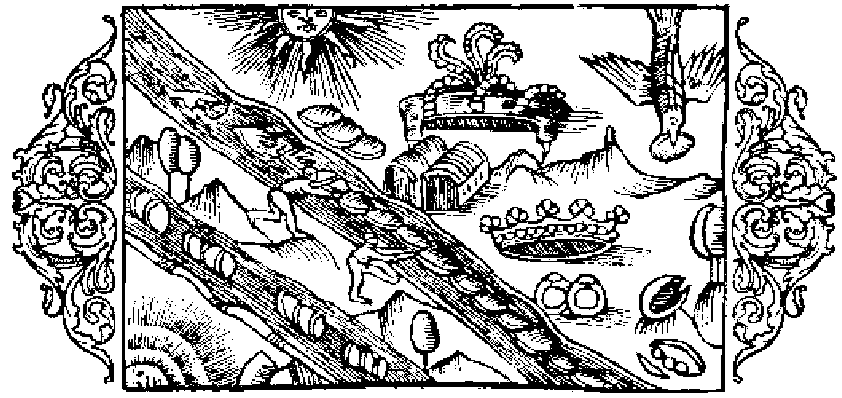

# Om pärlor och hur de alstras

Men för att nu icke alldeles lämna ur räkningen pärlorna, dessa fina alster, som jag efter att ha skildrat fiskarna försummat att omnämna, vill jag först och främst säga, att det i de nordiska länderna gifves vissa floder, där pärlor finnas, ity att musslor alstras i dem, ur hvilkas skal man hämtar hvitskimrande pärlor, låt vara att dessas glans på grund af den kalla luften är matt. Denna kyliga luft intränger nämligen, bemängd med dagg, vid midten af augusti månad i musslan och har den verkan, att de däri befintliga pärlorna desto fortare nå sin fulla utveckling. De sålunda uttagna pärlorna begagnas sedan af nordborna till prydnad och stå hos dem högt i pris; och när de blifvit på lämpligt sätt anbragta, äro de sköna att skåda i sin strålande glans. Denna skönhet veta prånglarna att ytterligare förhöja genom att putsa upp dem. Dessa föra emellertid äfven stora massor af Österlandets mera glänsande pärlor till Nordens kuster, att brukas, eller snarare missbrukas, företrädesvis af förnäma damer, men äfven af kvinnor i vanlig samhällsställning; och dessa ha sin fröjd åt sådana smycken, såsom varande mera sällsynta, och pläga bära dem i sina kronor, sina armband, sina axelkläden och äfven i sina hättor. Men ingen kvinna, hur förnäm hon än månde varit, har någonsin i Norden visat sig med pärlor eller ädelstenar fästade i öronen, af fruktan för det svåra klander hon därigenom skulle ådragit sig, liksom om ej naturen själf, denne store konstnär, hade förlänat hvarje lem dess behag och fägring, utan att man behöfde från annat häll, från simpla maskar, låna ytterligare prydnad därför. Förr plägade kvinnor af högsta stånd, såsom i det föregående (bok 24, kapitel 8) är sagdt, särskildt drottningar och hertiginnor, med egna händer sömma kyrkodräkter och smycka dem med ädelstenar och pärlor, som inköpts till högt pris, samt förära dem åt den Högstes tjänare, byars gudomliga majestät de menade sig aldrig kunna visa vördnad nog, att af dessa vid kyrkliga förrättningar begagnas. Men nu ha, Gudi klagadt, kvinnfolken kommit därhän i brinnande vanvett och ohejdad praktlystnad, att de sirligt infläta kostbara pärlor i håret och kanske förslösa en hel förmögenhet på slikt fåfängligt bjäfs, i tanke att till äfventyrs urartade veklingar af en sådan bedräglig ögonfägnad skola låta locka sig att skänka dem sin kärlek, som är fal för många, snarare än af deras tvifvelaktiga dygd, som bjuder ut sig med så mycken utländsk flärd. Och när af en ren slump äktenskap mellan sådana personer följer, hvad är det väl den äkta mannen får annat än en mussla full af pärlor, men på samma gång ett dumt våp? För öfrigt lär han ej heller själf bli ansedd som synnerligen förtänksam, då han ej af kvinnan begärde något värdefullare än sådant tomt prål, måhända också utskurna kläder, vällukter och fagert snack, hvarigenom hans sinnen, såsom han omsider skall finna, blifvit fullständigt bedårade. Alltnog, för att i denna sak kort och godt, utan omsvep säga min mening, så bör en kraftfull man följa den Vises råd (i Ordspråksbokens sista kapitel) och taga en kraftfull kvinna till hustru, på hvilken hans hjärta kan förlita sig, och bärgning kommer icke att fattas honom. — Till sist kan anmärkas, att Nero smyckade alla narrar och gycklare med kostbara pärlor, kanske i tanke att de så skulle likna honom själf.

- Floder i Norden, som hysa pärlor.
- Bleka pärlor.
- Prånglarna putsa upp pärlorna.
- Kvinnornas särskilda prydnad.
- Drottningar sömma kyrkodräkter.
- Hur veklingar lockas till kärlek.
- Flickarna bjuda ut sin kärlek.
- Utskurna kläder tecken till kränkt kyskhet.
- En kraftfull kvinna står högt i pris.