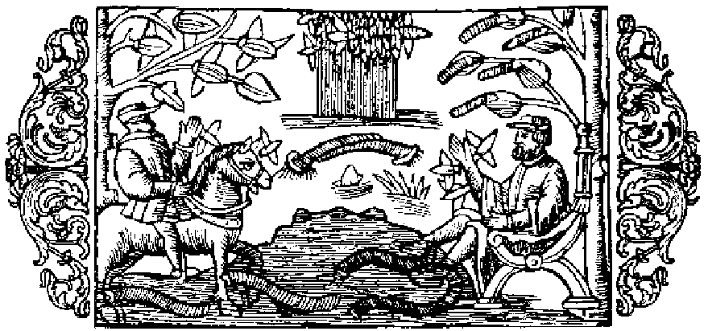

# Om blodiglar och olika slags maskar

På bilden här ofvan synas en man, som håller fötterna nere i vattnet, och blodiglar, som sitta fast vid dem, likaså en häst, vid hvars fötter ett sådant litet djur sugit sig fast. Denna framställning afser att visa, hurusom detta medel i de nordiska länderna allmänneligen plägar användas både för människor och dragare, när man vill aflägsna öfverflödigt eller skämds blod, om man också där tillika begagnar vanlig åderlåtning jämte koppning eller upphettadt horn, såsom man finner omnämndt i bok 15, kapitel 35, som handlar om bad, koppning och åderlåtning. För att nu vederlägga deras åsikt, som förmena, att det måste vara ytterst ondt om maskar, enkannerligen

af detta slag, i jorden och vattnet i dessa kalla landet, hvarest jorden tillfryser och blir hård som sten till fem eller sju fots djup, och vattnet likaledes, anser jag mig här böra bifoga en redogörelse för de olika maskarnas alstring och skaplynne, för att förklara hur de kunna förblifva oskadda i sådan svår köld. Maskar finnas i jorden, i vattnet, i luften, på trädens löf, i trä, i kläder, i kött, i fisk och slutligen i ost. Jordmaskarna, som föra flytta sig genom att under ringlande rörelser gradvis skjuta fram kroppens olika delar, hålla sig om vintern, enligt Aristoteles i hans verk om djuren (bok 7, kapitel 14), dolda i sprickor eller ådror i jorden, dit kölden icke når, helst under djup snö, som hindrar jorden att tillfrysa, och ligga där i dvala, säkert gömda. Snön lämnar också mullvadarna vägen fri att äta råttor och maskar af detta slag, enär råttorna under den djupa snön kila af och an mellan vattendragen och jordhålorna och där älven framföda sitt yngel. Härpå får man ett tydligt bevis, när snön smälter, ty man kan då skönja råttungarnas spår, hvilka te sig som maskarna i ett nät, och äfven deras bon. Till vattenmaskarna hör grodan, som om vintern håller sig dold i varma bäckar, stundom i underjordiska vattendrag, hvilka vintertid äro varma. Om våren går hon sedan fram till vattnet. Det händer ibland på hösten, att hon, ansatt af kölden, kommer in i boningshusen och kryper upp i eldstaden eller i knäet på en människa. Man bör lägga märke till följande förhållande. Enligt naturens lag hålla sig grodorna gemenligen tysta om hösten; men om en kväker till med befalllande stämma, så svara henne de otaliga andra, som ligga gömda i träsken därintill, såsom under parningstiden. Så tystna de plötsligt igen, och så, på nytt tillrop, skria de ännu mera öfverljudt och tystna ånyo, och ingen enda visar sig över vattenytan, ett tecken till att vintern skall bli långvarig. 

- Blodiglar nyttiga.
- Åderlåtning bruklig i Norden.
- Jorden tillfryser och blir hård som sten.
- Olika slags maskar.
- Jordmaskar.
- Den djupa snön bevarar jorden från att tillfrysa.
- Vattenmaskar.
- Grodorna komma fram på vintern.
- Tecken till långvarig vinter.