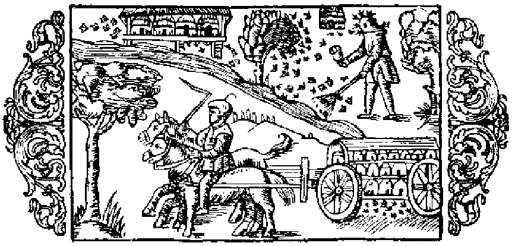

# Om bien och deas olika näring

Likasom de nordiska länderna äro rika på åtskilliga ting, såväl nödvändiga som ock mindre behänga, hvaraf de kunna dela med sig till andra folks bruk, så ha de äfven, tack vare naturens särskilda ynnest och försorg, blifvit hugnade med honung i riklig måtto, och man nedlägger också städse och allestädes stor omsorg på biens skötsel, att dessa så genom en samvetsgrann värd måtte skyddas och förkofras. När honungen blifvit uttagen ur kuporna, har folket för sed att lämna kvar blott så mycket däraf åt de unga bien, som tyckes räcka för dem till föda under vintern, det vill säga två tredjedelar, emedan de om vintern och i början af våren, innan blommorna slå ut, mestadels lefva af honung, sönderstyckade fikon och torkade drufvor, hvilka frukter man skaffar sig från annat håll. Men enär detta är utländska varor, som man sällan kommer öfver, är det förnämligast honung man lämnar dem till föda, då ju denna äfven kan köpas billigare än sagda varor. I nödfall plägar man emellertid, i stället för att gifva dem honung, mata dem med sönderstötta bönor eller ärter, kakor beredda af vallmofrön, hvetemjöl fuktade med mjöd, eller ock med kött af nyslaktade kycklingar, hackadt i helt små bitar. Plinius omtalar (bok 11, kapitel 16), att bien ›under de sextio dagarna från vintersolståndet till Arcturi uppgång lefva af sömn utan att förtära någon föda; från Arcturi uppgång till vårdagjämningen, då det börjar bli ljummare i luften, äro de visserligen vakna, men hålla sig ännu inne i kupan och uppsöka då åter den föda, som spar rats till den tiden›. Aristoteles säger emellertid i sitt verk om djuren, bok 8, kapitel 14 och 17, att myran, råttan, mullvaden och andra insekter och små djur hela vintern hålla sig dolda i sina bon; vidare att bien gömma sig i sina kupor, så länge den starka kölden varar, och icke smaka den för dem tillredda födan, och att, om de någonstädes krypa fram, de se utsvultna ut, med tom och genomskinlig buk. Dock synes han längre fram, bok 9, kap, 40, vara af motsatt mening. Därjämte påstår han, att de hylla sig frän Plejadernas nedgång till våren, hvilken åtminstone för Nordens vidkommande, när det gäller den för bien lämpliga tiden att gå ut ur kupan, måste fattas såsom början eller midten af maj månad, eftersom först då träden börja att löfvas och blomma och brodden på fält och ängar att spira upp, för att i sinom tid gifva riklig äring och ymnigt bete åt djuren, och bien först då börja samla honung i större myckenhet. Men till förnyad fortplantning stiga svärmarna upp i juni, i akt och mening att söka sig nya boplatser, och vid tiden för sommarsolståndet dela de sig i skilda skaror under olika anförare. Då måste biens ägare låta sig sära skildt angeläget vara att vakta sin bevingade hjord, att den ej må flyga bort utom synhåll; hvarom nedan skall talas. Märkas bör ock, att, om blomstren vissna på fälten i följd af alltför stark och ihållande torka, bien till föda böra få honung eller något annat, däremot svarande, beredt af något sött ämne.

- Godt om honung i Norden.
- Biens föda om vintern.
- Hvarmed bien matas i nödfall.
- Bien lefva af sömn i 60 dagar.
- Aristoteles åsikt om tiden för biens kvarstannande i kupan.
- Blomstertiden kommer sent i Norden.
- När bisvärmen måste vaktas.
